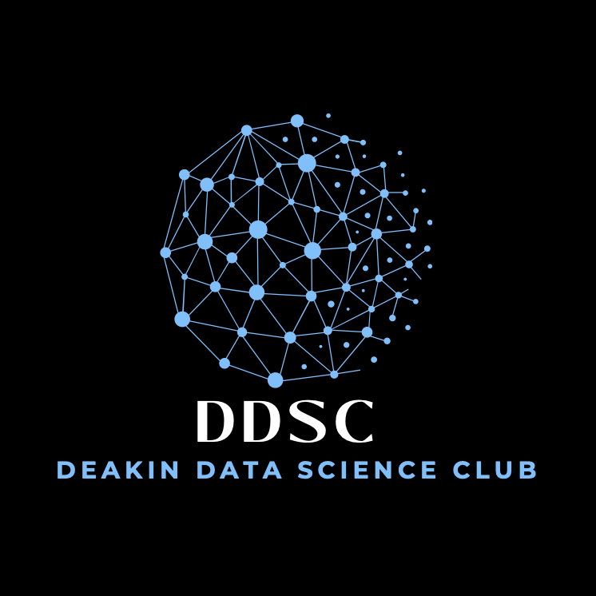

# Deakin Data Science Club Website



Welcome to the official website of the Deakin Data Science Club (DDSC). This platform serves as the central hub for all club activities, events, and resources.

## Features

- **Club Information**: Learn about our mission, vision, and activities
- **Event Calendar**: Stay updated with upcoming workshops and hackathons
- **Member Resources**: Access learning materials and project opportunities
- **Contact Form**: Get in touch with the club leadership
- **Discord Integration**: Join our community discussions

## Technologies Used

- HTML5
- CSS3 (Bootstrap)
- JavaScript
- PHP (for forms)
- SCSS

## Setup Instructions

1. Clone the repository:
   ```bash
   git clone https://github.com/yourusername/ddsc-website.git
   ```

2. Navigate to the project directory:
   ```bash
   cd ddsc-website
   ```

3. Open the website in your browser:
   ```bash
   open index.html
   ```

## Recent Updates (2025-03-22)

- Updated Discord invite link
- Added "Join DDSC" section to homepage
- Implemented dark overlay for hero section images
- Fixed CSS syntax errors
- Optimized website structure

## Contributing

We welcome contributions from the community! Please follow these steps:

1. Fork the repository
2. Create your feature branch (`git checkout -b feature/AmazingFeature`)
3. Commit your changes (`git commit -m 'Add some AmazingFeature'`)
4. Push to the branch (`git push origin feature/AmazingFeature`)
5. Open a Pull Request

## License

This project is licensed under the MIT License - see the [LICENSE](LICENSE) file for details.

## Contact

For any inquiries, please email us at deakindatascienceclub@gmail.com
